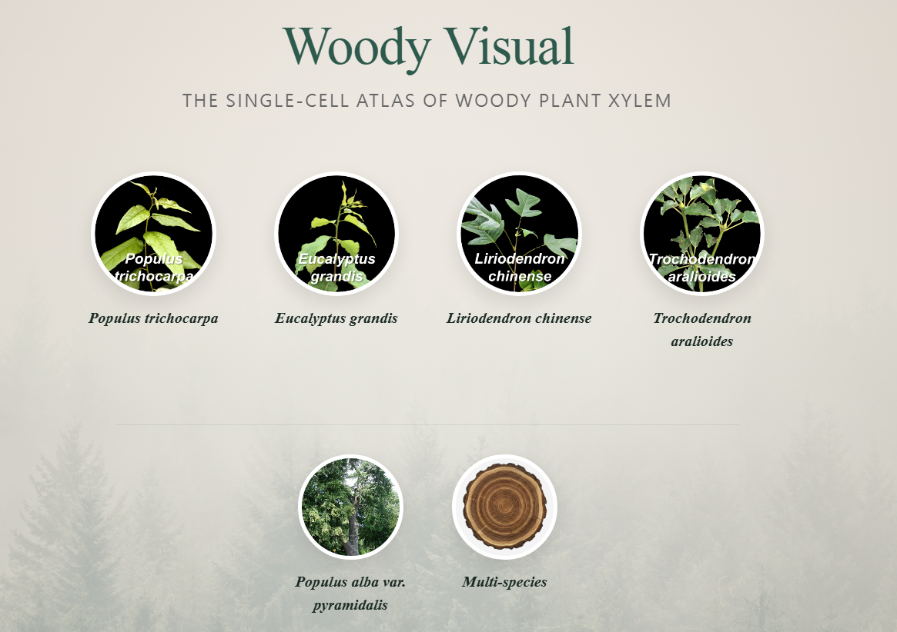
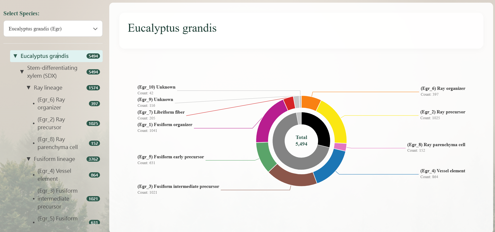
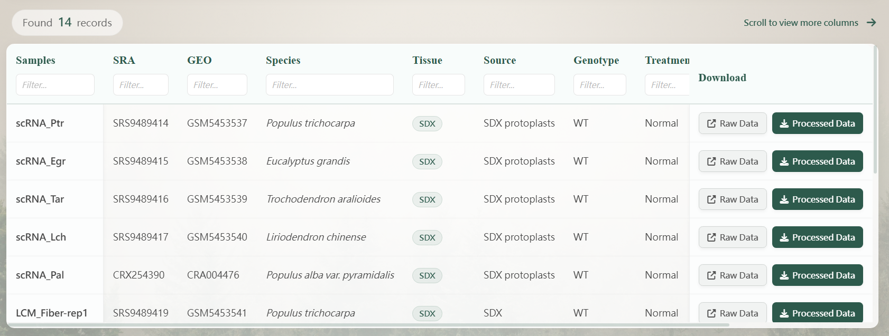
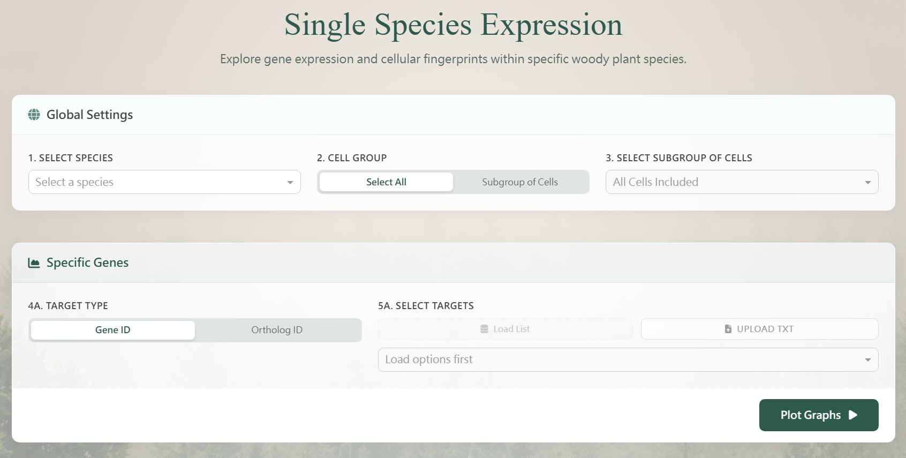
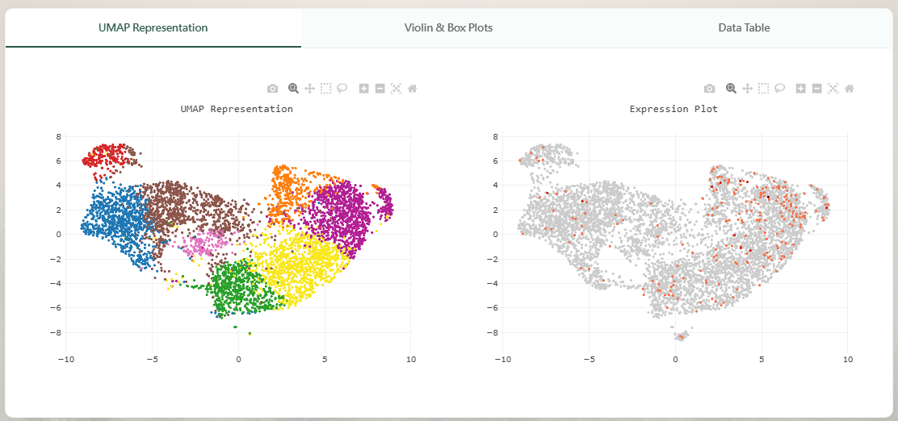
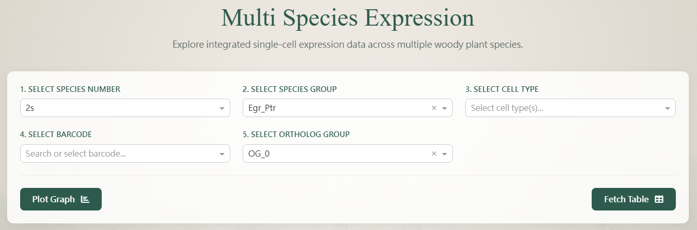
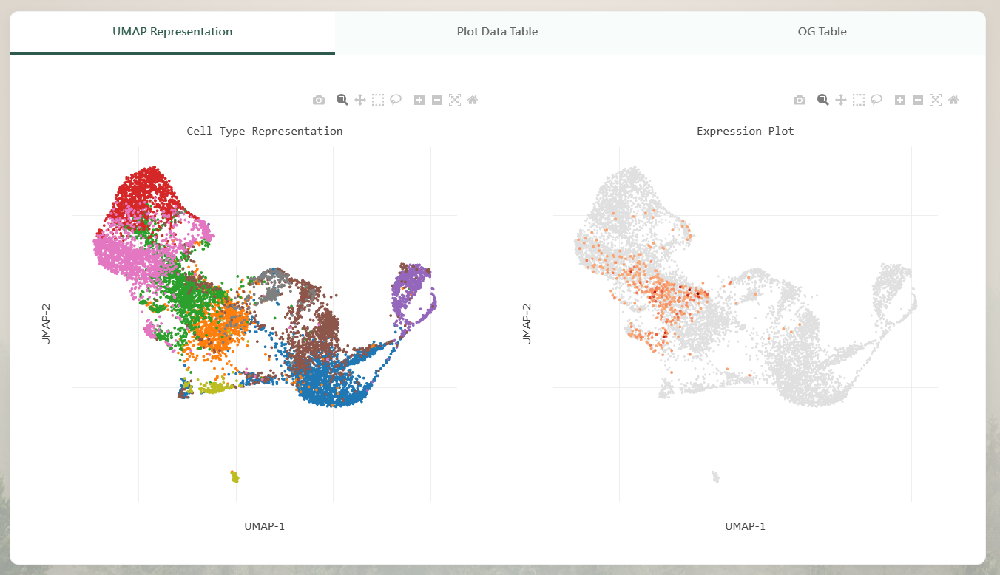

# Woody Visual User Guide

Welcome to the **Woody Visual** Database Visualization Platform! This platform is dedicated to the visualization of stem-differentiating xylem (SDX) single-cell UMAP (Uniform Manifold Approximation and Projection) and comprehensive transcriptomic profiles.

The website is organized into five main tabs: **Home**, **Cluster**, **Download**, **Single-Species**, and **Multi-Species**. Please refer to the guide below to familiarize yourself with the platform's functionalities.

---

## 1. Home

The home page provides a general overview and quick navigation pathways for the database.

* **Introduction**: Learn about the research background, methodology (including scRNA-seq and lcmRNA-seq), and primary purpose of this evo-devo framework.
* **Quick Navigation**: Click on the image hyperlinks of various divergent woody angiosperms to jump directly to the **Cluster** page. This will automatically filter and display the transcriptomic profiles and scRNA-seq cell clusters for that specific plant.
* **Database Statistics**: View real-time statistics regarding the collected cell and transcript abundance data.

---

## 2. Cluster

This tab provides a high-level overview of the SDX cell composition proportions across different plant species.

* **Cluster Pie Charts**: Visualizes the unsupervised K-means cell clusters for the main woody species via interactive pie charts.
* **Detailed Information**: By interacting with the pie charts and the left-side navigation menu, you can thoroughly examine the UMAP scRNA-seq cell clusters (representing annotated cell types) proportions and exact cell counts for various sub-categories within each plant.

---

## 3. Download

Access and download the raw data, single-cell transcript abundance matrices, and associated databases used in our research through this portal.

* **Data Filters**: Precisely locate the dataset you need by configuring various parameters, including: 
  `Samples`, `SRA`, `GEO`, `Species`, `Tissue` (e.g., SDX), `Source`, `Genotype`, `Treatment`, `DataType`, and `Technology` (e.g., 10x Chromium, MARS-seq2.0, lcmRNA-seq).
* **Clear Filters**: Use this single button to reset the panel and clear all selected filter conditions.
* **Download Methods**:
  * **Rawdata Link**: Access the direct link to the NCBI SRA or GEO repository (e.g., [SRS9489414](https://www.ncbi.nlm.nih.gov/sra/SRS9489414)).
  * **Direct Download**: Click the download button to instantly acquire the original `.tar` or `.csv` archive files.

---

## 4. Single-Species

Perform in-depth transcriptomic profiling and marker gene expression analysis focused on a single species. The control panel is structured into three distinct cards, allowing you to generate UMAP, expression plot, violin plot, box plot and specific single-cell heatmaps.

Please follow these analytical steps:

### 📍 Card 1: Global Settings (Required)
*Start here to define the base dataset for your analysis.*
1. **Select Species**: Choose your target species from the dropdown (e.g., `Egr` for *Eucalyptus grandis*, `Lch` for *Liriodendron chinense*, `Ptr` for *Populus trichocarpa*, `Pal` for *Populus alba* var. *pyramidalis*, `Tar` for *Trochodendron aralioides*).
2. **Cell Grouping**: Define the cell observation range by choosing either **Select All** or **Subgroup**.
3. **Select CellTypes**: *(Enabled only if 'Subgroup' was selected)* Choose specific annotated cell types or precursors (e.g., fusiform organizer, ray precursor). Unselected clusters will be dimmed in the final visualization.

### 📍 Card 2: Expression Analysis
*Use this section to visualize transcript abundance (UMI counts) across cell populations.*
1. **Target Type**: Choose the identifier type (`Gene ID` or `Orthologous Group ID`).
2. **Select Targets**: Click **Load List** to fetch available IDs from the database, or use **Upload TXT** to import your custom list (multiple selections are supported).
3. **Execute**: Click the **Plot Graphs** button. The results will populate in the `UMAP Representation`, `Violin & Box Plots`, and `Data Table` tabs below.

### 📍 Card 3: Single-Cell Transcriptomic Profile
*Use this section to examine the entire transcriptomic profile of a specific single cell.*
1. **Locate Cell Barcode**: Search and select a specific cell Barcode (the available list is based on your Global Settings).
2. **Execute**: Click the **Plot Heatmap** button. The result will populate in the `Cell Heatmap` tab below.

### 📊 Chart & Visualization Area
Located at the bottom of the page, the generated results are organized into specialized tabs:

* **UMAP Representation**: The left graph displays the complete UMAP and cell clusters for the species; the right graph displays the targeted Expression Plot highlighting the transcript abundance of your selected genes.
* **Violin & Box Plots**: Contains four comprehensive distribution graphs. The top graph shows the normalized UMI counts Violin Plot. The bottom three sequentially display developmental trajectories/cell lineages for *Ray*, *Vessel*, and *Libriform Fiber* (or *Tracheid* depending on the species).
* **Data Table**: Presents a highly detailed data matrix corresponding to your expression analysis, detailing `Barcode`, `UMAP-1`, `UMAP-2`, `Transcript Abundance (UMI)`, and `CellType`. You can export this data using the **Download CSV** button.
* **scRNA-seq & lcmRNA-seq Correlation**: *(Conditional Tab)* This tab appears exclusively when evaluating specific species (e.g., *Ptr*), providing specialized Laser Capture Microdissection (LCM) transcriptomic correlation plots for libriform fibers, vessel elements, and ray parenchyma cells.
* **Cell Heatmap**: Displays the targeted single-cell transcriptomic profile heatmap.

---

## 5. Multi-Species

This advanced module allows you to perform cross-species pairwise correlation or integrated analysis to compare the transcript abundance of specific Orthologous Groups simultaneously across divergent woody angiosperms.

### 📍 Operation Flow
1. **Select Species Number**: Define how many species you want to integrate at once (Options: `2s`, `3s`, `4s`, `5s`).
2. **Select Combination**: Choose the specific species pairing/combination (e.g., `EGR_PTR` or `EGR_LCH` under the 2S mode).
3. **Select CellTypes**: Choose specific cell clusters (e.g., `Vessel element` or `Fusiform intermediate precursor`).
4. **Select Barcode**: Pick the specific Barcodes you wish to observe within the chosen combination (multiple selections supported).
4. **Select Orthologous Group**: Choose the target orthologous group for observation (single selection).
5. **Execute**: Click **Plot Graph** to generate the comparative visualization.

### 📊 Charts and Data Panel
Located at the bottom of the page, review your multi-species integrated comparison:

* **UMAP Presentation**: The left graph displays the complete graph-based cell clustering UMAP for the cross-species combination; the right graph displays the filtered transcript abundance Expression Plot.
* **Plot Data Table**: Provides a data table corresponding to the filtered Barcodes, including `Transcript Abundance (UMI)`, `UMAP-1 Coordinate`, `UMAP-2 Coordinate`, and `Orthologous_Group`.
* **OG Table (Orthologous Group Table)**: By clicking the **Fetch Table** button (located on the right side of the analysis section), this panel will populate to list all specific homologous protein-coding genes included within your selected Orthologous Group.

