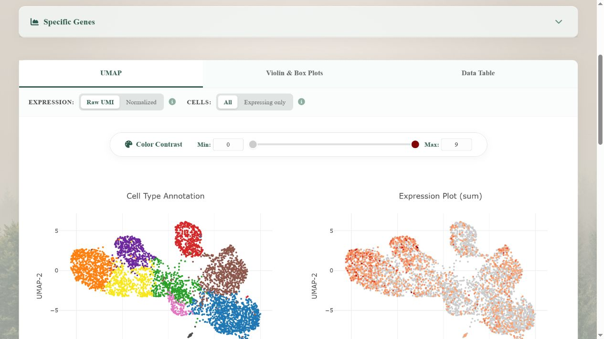
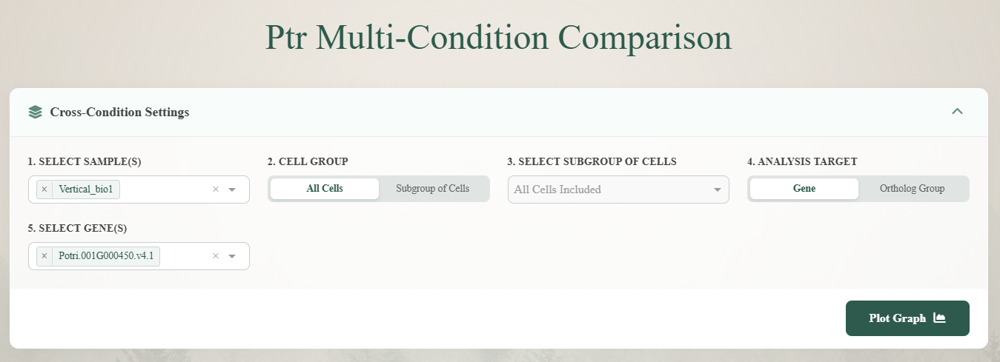
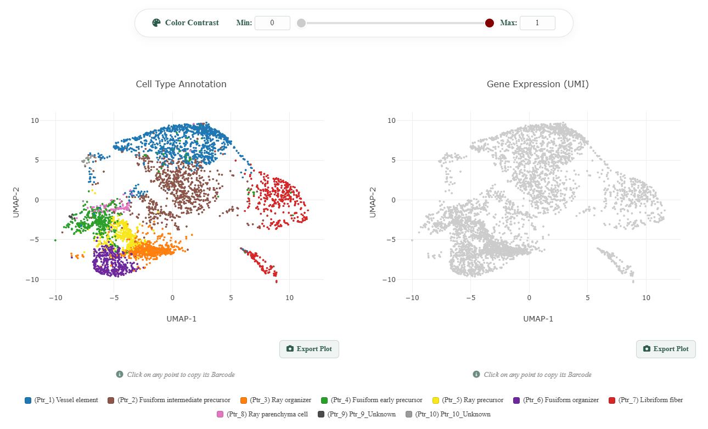
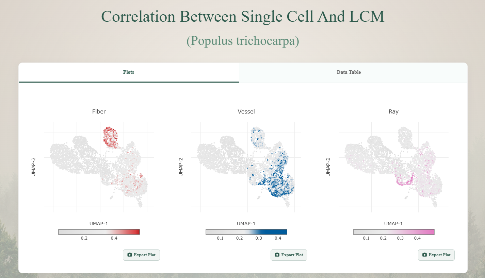
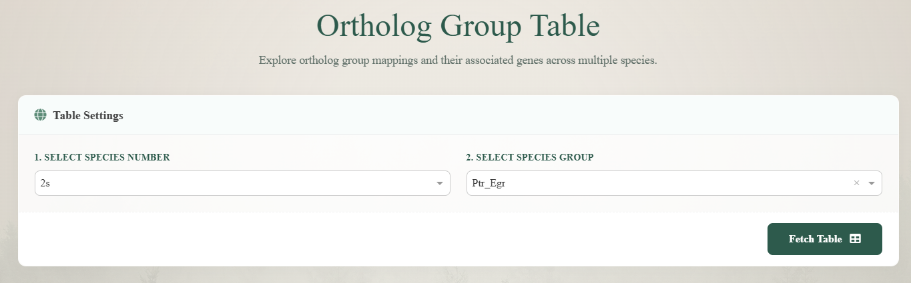
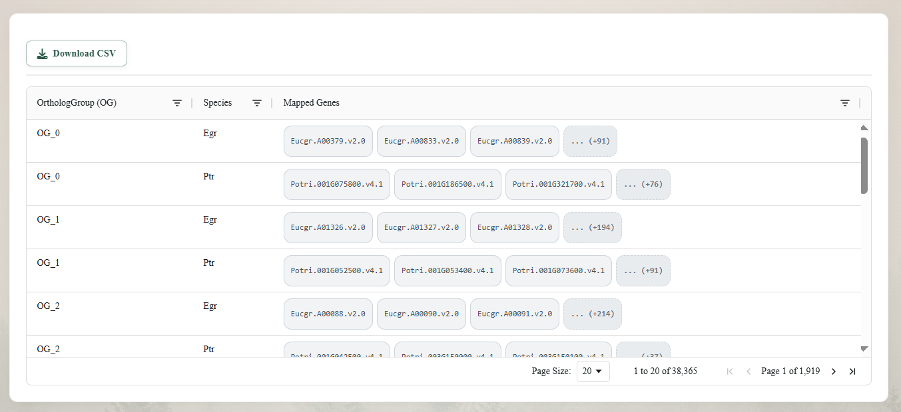
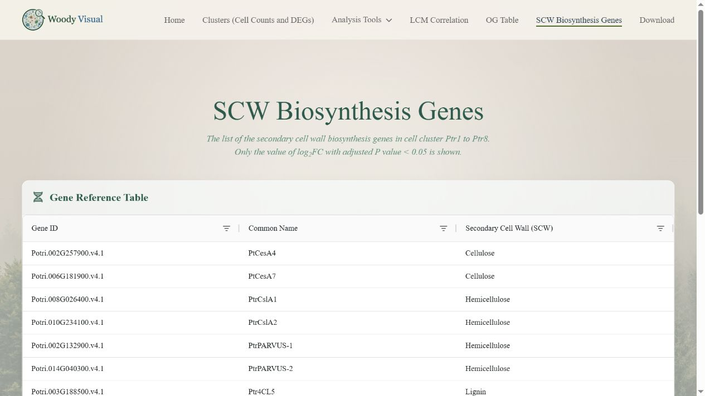

# WoodyVisual User Guide

**WoodyVisual** is a web resource for exploring gene activity in the developing wood of several woody plants. It is designed for plant researchers, students, and anyone who wants a guided way to look at cells, genes, and public datasets.

Open the website: [WoodyVisual](https://acres-bobby-bradley-normally.trycloudflare.com/)

This guide follows the current website menu. It uses simple language on purpose: you do not need to be a bioinformatics specialist to begin. Where a scientific term is useful, it is explained in place.

---

## What can I do here?

Use WoodyVisual when you want to:

- find where a gene is active in a woody plant;
- see the main groups of cells in developing wood;
- compare the same gene family across two species;
- compare *Populus trichocarpa* samples grown under different conditions;
- browse genes linked to secondary cell wall formation; or
- find the original data behind a plot.

The site is a tool for **exploration**. A plot can help you form a good question, but it does not by itself prove that two cell groups are identical or that a gene changes significantly between treatments.

---

## A few helpful words

| Word on the website | Plain-language meaning |
|---|---|
| **SDX** | Developing wood in the stem. |
| **Cell type** | A group of cells with a similar pattern of active genes. |
| **UMAP** | A map that places cells with similar gene activity near each other. It is a useful picture, not a photograph of the stem. |
| **Gene ID** | The database name for a gene. It is often more reliable than a short gene symbol. |
| **OG** | An orthologous group: related genes from different species that may share an older common ancestor. |
| **Ray** | Cells that run across the wood from the centre toward the bark. |
| **Fusiform** | Cells in the long, vertical system of wood. This group includes the paths that lead to vessel and fibre cells. |
| **SCW** | Secondary cell wall, the strong wall that many wood cells build as they mature. |
| **LCM** | A way to collect a small, visible piece of tissue for gene-activity measurement. |

The names and ideas used here follow the woody-plant cell work described by Tung et al. (2023) and the study of normal, tension, and opposite xylem in *Populus* by Hsieh et al. (2025). See [Scientific background](#scientific-background) for the papers.

---

## Quick start: choose the right page

| If you want to... | Start here | Then go to... |
|---|---|---|
| See where one gene is active | **Single-Species** | Download, if you need the data file. |
| See the main cell groups in a species | **Clusters** | Single-Species to check a gene. |
| Compare related genes between species | **OG Table** | Multi-Species. |
| Compare normal and treated *Populus* samples | **Ptr Multi-Condition** | Download to read sample details. |
| Start from wood cell-wall genes | **SCW Biosynthesis Genes** | Single-Species, then OG Table if needed. |
| Find a public dataset or accession number | **Download** | The original SRA/GEO record. |

---

## 1. Home

The Home page introduces the database and the species it contains. Use it to decide whether WoodyVisual includes the plant and type of question you care about.

### How to use it

1. Read the short introduction and check the available species.
2. Use the top menu to choose the page that matches your question.
3. Keep note of each species abbreviation. For example, `Ptr` means *Populus trichocarpa* and `Egr` means *Eucalyptus grandis*.

### Good first choice

If you already have a gene name or gene ID, go straight to **Single-Species**. If you are still learning which kinds of wood cells are present, open **Clusters** first.

---

## 2. Clusters

Clusters gives an overview of the cell groups found in the selected species. It is the best page for beginning with the question: “What kinds of developing wood cells are in this dataset?”

### How to use it

1. Choose a species.
2. Look at the cell-group display and the number of cells in each group.
3. Select a group, where available, to see its smaller groups or details.
4. Write down a cell-group name that interests you, then use **Single-Species** to check genes in that group.

### Read this page carefully

The number of cells shown is the number captured in this dataset. It is not automatically the true proportion of cells in a living stem. Sample preparation can make some cell types easier to collect than others.

If you see an `unknown` group, treat it as a group that has not yet been given a confident name. Do not assume it belongs to the nearest named group.

---

## 3. Single-Species

Single-Species is the main page for checking one gene in one plant species. It can show a cell map, a gene-activity view, simple distribution plots, and a table of the cells used in the plot.

### Step-by-step

1. In **Species**, choose your plant. Example: choose `Ptr` for *Populus trichocarpa*.
2. Click **Load Gene List Below** or the similar button shown on the page.
3. Search for and choose your gene. Use the full Gene ID when possible.
4. Choose the display option you need:
   - **All cells** is best when you want the whole picture.
   - **Expressing only** is useful for seeing where positive cells are, but it hides cells with no detected signal.
5. Click **Plot Graph** or **Plot Graphs**.
6. Read the results from left to right: first the cell map, then gene activity, then the distribution plots and data table.

### What you will see

- **Cell map / UMAP**: each dot is usually one cell. Nearby dots have more similar gene-activity patterns.
- **Expression plot**: shows where your selected gene is more or less active.
- **Violin or box plot**: shows how activity differs across cell groups.
- **Data table**: lists the cells and values used for the current view. Download it if you need to save the result.

### Useful tips

- If nothing appears after plotting, first check that you selected a species **and** loaded the gene list. Then close any open multi-select menu and try the plot button again.
- If a gene is missing, check the Gene ID and species. A gene symbol used in one species may not be used in another.
- When selecting several genes, make sure you know whether the page is showing each gene separately or combining them. For a first check, use one gene at a time.

---

## 4. Multi-Species

Multi-Species lets you compare a related group of genes across two or more woody plants. Start with an OG rather than assuming that two short gene names are direct matches.

### Step-by-step

1. Choose the number of species, if the page asks for it.
2. Choose the species combination, for example `Ptr–Egr`.
3. If available, limit the view to cell types that match your question.
4. Load and choose an **OG**.
5. Choose display settings, such as the species to highlight or whether to show only cells with a signal.
6. Click **Plot Graph**.
7. Open **OG Table** to check the actual gene members in that OG.

### How to read the result

The plot is a comparison aid. Before describing a pattern as “shared between species”, check:

1. Does each species have one gene in the OG, or several?
2. Are you looking at the same broad cell type in both species?
3. Do the single-species plots tell a similar story?

Cells placed close together on a combined map are not automatically the same cell type. Use the map together with cell names, known marker genes, and biological knowledge of wood development.

---

## 5. Ptr Multi-Condition

This page compares *Populus trichocarpa* samples from different conditions. It is useful for exploring how a gene behaves across the sample groups available on the page.

### Step-by-step

1. In **Select Sample(s)**, choose one or more samples. The screenshot shows `Vertical_bio1` as an example; use the names currently available on the page.
2. In **Cell Group**, keep **All Cells** for a first overview, or choose **Subgroup of Cells** to focus on selected cell types.
3. If you chose a subgroup, select it in **Select Subgroup of Cells**.
4. In **Analysis Target**, choose **Gene** or **Ortholog Group**.
5. In **Select Gene(s)**, choose the gene you want to view.
6. Click **Plot Graph**.
7. Check the cell map, the gene-activity map, and any comparison plot or data table below.
8. Before making a biological statement, use **Download** to read what each sample label means.

### How to read it

This page is especially helpful for learning about tension wood. Tension wood is wood made in response to a plant being bent or pulled by gravity. Hsieh et al. (2025) compared normal, tension, and opposite xylem in *Populus* and showed that changes can involve both the speed of cell development and the balance of cell types.

### Important reminder

A visible difference in a box plot is a useful clue, not final proof. Check how many plant samples were used and what each point represents before making a strong claim.

---

## 6. LCM Correlation

LCM Correlation helps you compare the site’s single-cell view with measurements made from small pieces of wood tissue. It gives an extra way to ask whether a cell group looks more fibre-like, vessel-like, or ray-like.

### Step-by-step

1. Open **LCM Correlation**. The current page is for *Populus trichocarpa*.
2. In the **Plots** tab, compare the three maps labelled **Fiber**, **Vessel**, and **Ray**.
3. Use the colour bars below each map to see where the matching tissue signal is stronger or weaker.
4. Open **Data Table** when you need the values behind the plots.

### How to use the information

Treat this page as supporting evidence. If a cell labelled as a fibre has a strong vessel-like signal, it may be a transition-stage cell, a mixed cell, or a cell that needs more checking. Do not rename it from one number alone.

---

## 7. OG Table

OG Table is the place to find related genes before making a cross-species plot. It helps answer: “What is the matching gene group in another plant?”

Open the page: [OG Table](https://acres-bobby-bradley-normally.trycloudflare.com/og-table)

### Step-by-step

1. In **Select Species Number**, choose how many species you want to compare. Use `2s` for a first comparison.
2. In **Select Species Group**, choose a pair, such as `Ptr_Egr`.
3. Click **Fetch Table** and wait for the table to appear.
4. Read the **OrthologGroup (OG)**, **Species**, and **Mapped Genes** columns.
5. Expand a shortened gene list such as `... (+N)` to see every listed gene.
6. Use **Download CSV** to save the current table, or copy an OG ID into **Multi-Species**.

### How to use a large table

Some species pairs return many pages of results. For example, the Ptr–Egr table can contain tens of thousands of links between genes. Do not try to scan every page. Start with the gene ID you already know, then check whether the selected OG has one gene or several genes in each species.

### A simple rule

If one species has several genes in the same OG, do not call them all “the same gene”. They are related, but each may have taken on a different role.

---

## 8. SCW Biosynthesis Genes

This page is a short list of genes related to building the strong inner wall of mature wood cells. It is a good starting point for projects on cellulose, hemicellulose, or lignin.

### Step-by-step

1. Open the page and wait for the gene list to finish loading.
2. Browse the genes by their wall-building group, such as cellulose, hemicellulose, or lignin.
3. Note the Gene ID of a gene that interests you.
4. Open **Single-Species** to see where that gene is active.
5. Use **OG Table** if you want to find related genes in another species.

### How to read the list

This page tells you that a gene is a useful **candidate** for a cell-wall question. It does not, on its own, show that the gene is active in every wood cell or in your chosen sample. Always check the gene in Single-Species.

---

## 9. Download

Download helps you find the public datasets behind the website and obtain files for your own work.

### Step-by-step

1. Start with one filter, usually **Species**.
2. Add another filter only if needed, such as Tissue, Treatment, Technology, or Data Type.
3. Read the dataset row carefully. It may show the sample name, SRA/GEO link, tissue, genotype, treatment, and method used.
4. Choose the appropriate link:
   - **Raw data**: original sequencing data, usually from SRA or GEO.
   - **Processed data**: prepared files such as a gene table, cell information, or a ready-to-use matrix.
5. Save the accession number and citation information with your project notes.

### Example

Typing `Eucalyptus` in the Species filter previously reduced the table to the relevant *Eucalyptus grandis* dataset. The row showed `scRNA_Egr`, the SRA/GEO source, SDX protoplast material, WT, Normal, and MARS-seq2.0.

### Before downloading

Check that the species, tissue, sample condition, and data type match your question. Keep the dataset version and the original accession number: both are important when you later share or publish your analysis.

---

## Common questions

### I clicked a button and no plot appeared. What should I do?

Check that you chose a species, loaded the list, and selected at least one gene or OG. Then wait briefly. If a multi-select menu is still open, close it and try again.

### Can I say that a gene is “specific” to one cell type from one plot?

Use careful language. A plot can show that a gene is **mainly seen** in one group in this dataset. For a stronger claim, check more than one dataset, read the original paper, and compare with known biology.

### Can I compare gene values from two different species directly?

Use the comparison as a guide, not as an exact measurement. First make sure the genes are related in the OG Table, then consider differences in sampling, gene copies, and how the data were prepared.

### Why do some cells have no visible signal for a gene?

Sometimes a gene is genuinely inactive. In single-cell work, a weak signal can also be missed because only part of each cell’s RNA is captured. Check the overall pattern instead of judging one dot alone.

---

## Scientific background

This guide uses the cell names and biological context of the following studies:

1. Tung, C.-C., Kuo, S.-C., Yang, C.-L. *et al.* **Single-cell transcriptomics unveils xylem cell development and evolution.** *Genome Biology* 24, 3 (2023). The study used single-cell and tissue-sample gene data to describe ray and fusiform cell lineages across woody flowering plants. [Read the article](https://doi.org/10.1186/s13059-022-02845-1).
2. Hsieh, J.-W. A., Liou, P.-C., Lin, C.-C. *et al.* **Single-cell and spatial multiomics identifies heterogeneous xylem development driven by mechanical stress in Populus.** *Developmental Cell* 60, 3131–3148.e8 (2025). The study examined normal, tension, and opposite xylem in *Populus*. [Read the article](https://doi.org/10.1016/j.devcel.2025.06.038).

These papers provide the biological background for understanding ray cells, fusiform cells, fibre and vessel development, and tension wood. They should be cited when their results or terminology are used in a report or publication.
